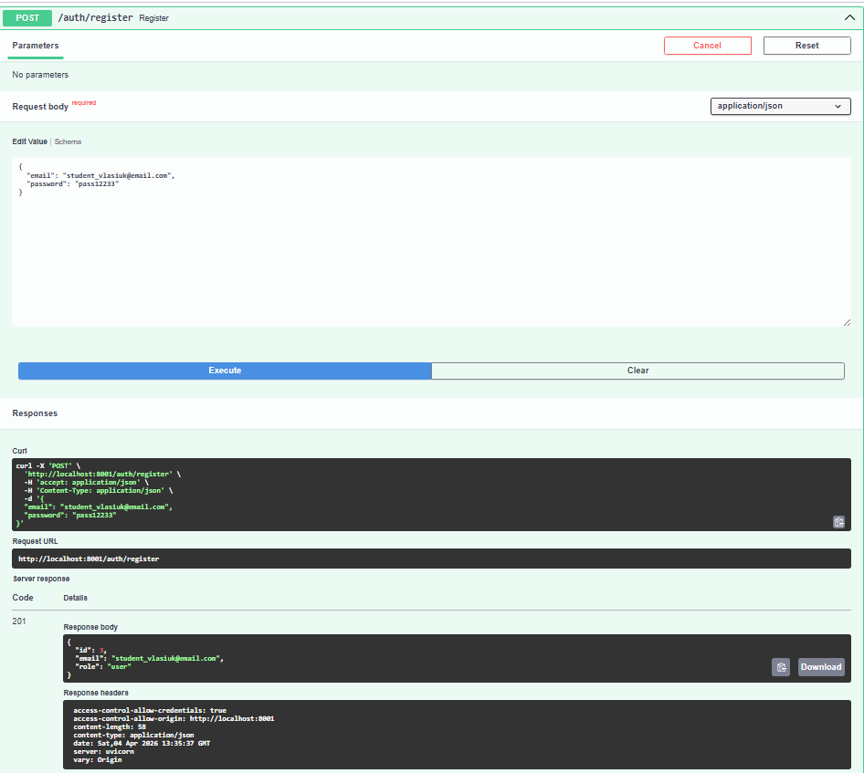
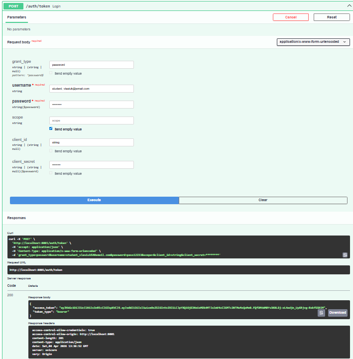
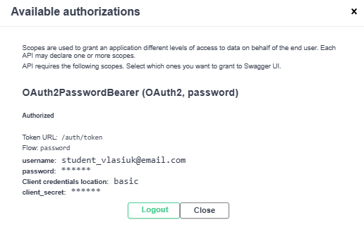
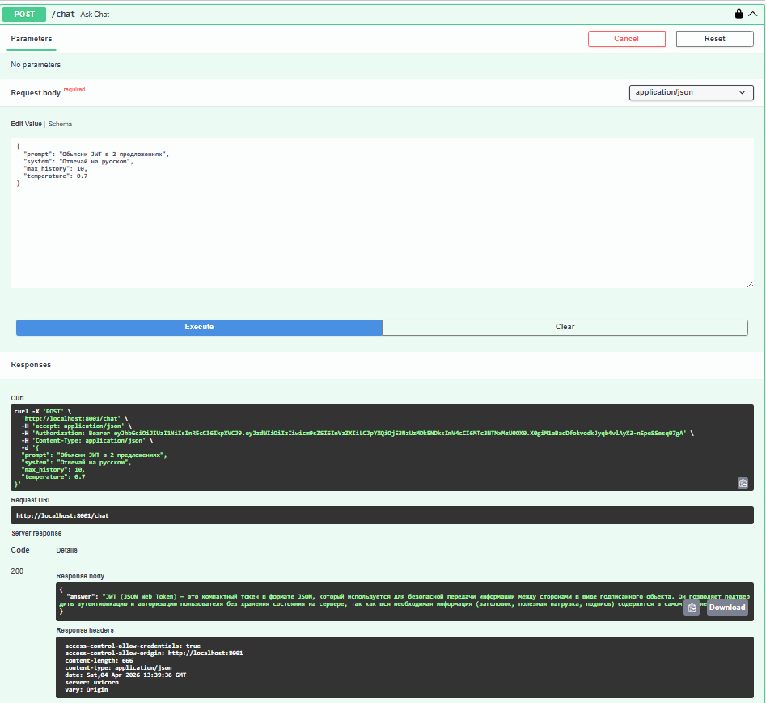
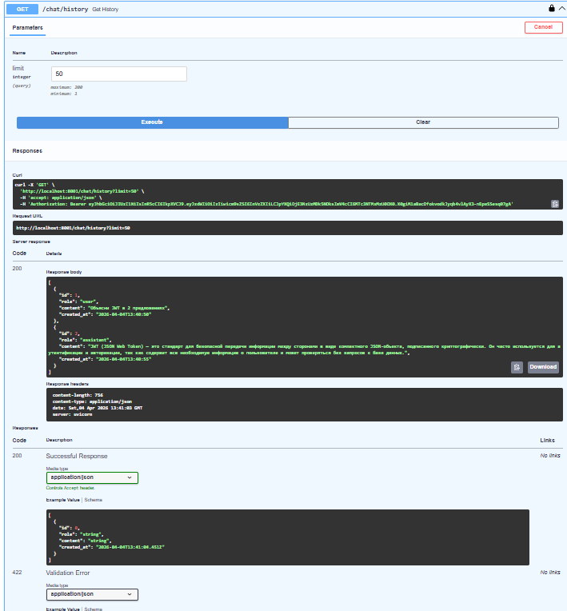
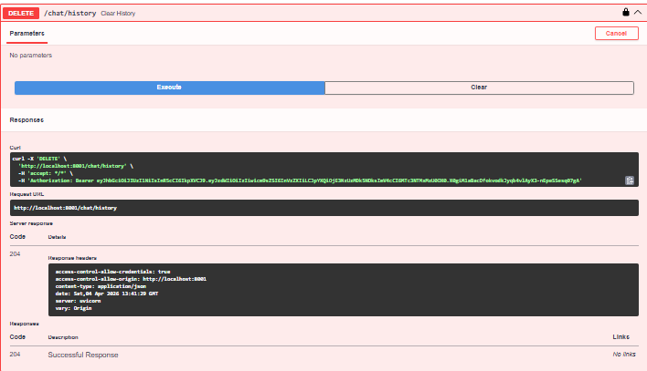
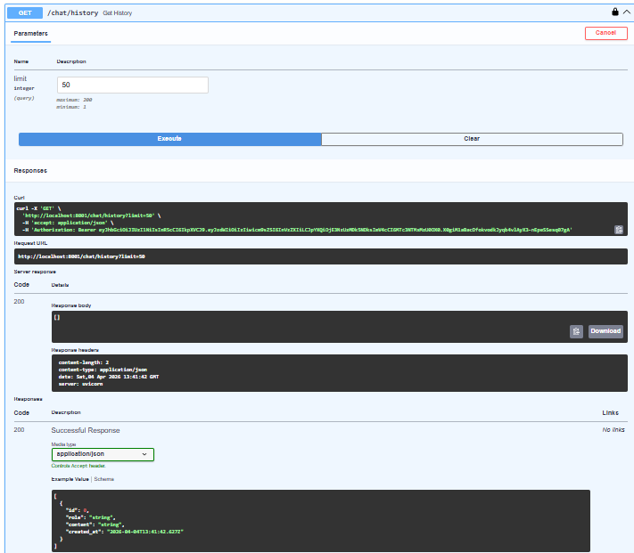

# llm-p

FastAPI сервис с JWT-аутентификацией, SQLite и проксированием запросов в LLM через OpenRouter.

## Что реализовано

- Архитектура по слоям: `api -> usecases -> repositories -> db/services`
- Регистрация, логин (OAuth2PasswordRequestForm), `JWT access token`
- Защищенные эндпоинты с `OAuth2PasswordBearer` для Swagger Authorize
- Интеграция с OpenRouter (`POST /chat/completions`)
- Сохранение истории диалога в SQLite
- Получение и очистка истории текущего пользователя

## Структура проекта

```text
llm-p/
├── pyproject.toml
├── README.md
├── .env.example
└── app/
    ├── main.py
    ├── core/
    ├── db/
    ├── schemas/
    ├── repositories/
    ├── services/
    ├── usecases/
    └── api/
```

## Установка и запуск через uv

1) Установите `uv`:

```bash
pip install uv
```

2) Создайте окружение:

```bash
uv venv
```

3) Активируйте окружение:

```bash
# Windows
.venv\Scripts\activate

# MacOS/Linux
source .venv/bin/activate
```

4) Установите зависимости:

```bash
uv pip install -r <(uv pip compile pyproject.toml)
```

Для PowerShell можно использовать:

```powershell
uv pip compile pyproject.toml -o requirements.txt
uv pip install -r requirements.txt
```

5) Подготовьте `.env`:

```bash
cp .env.example .env
```

Заполните `OPENROUTER_API_KEY` в `.env`.

6) Запустите приложение:

```bash
uv run uvicorn app.main:app --reload --host 0.0.0.0 --port 8000
```

Swagger: [http://localhost:8000/docs](http://localhost:8000/docs)

### Быстрый запуск через скрипт (PowerShell)

```powershell
# Первичная настройка (venv + зависимости + .env)
powershell -ExecutionPolicy Bypass -File .\scripts\dev.ps1 -Action setup

# Запуск приложения
powershell -ExecutionPolicy Bypass -File .\scripts\dev.ps1 -Action run

# Проверка линтера
powershell -ExecutionPolicy Bypass -File .\scripts\dev.ps1 -Action lint
```

## Эндпоинты

- `POST /auth/register` — регистрация
- `POST /auth/token` — логин, получение JWT
- `GET /auth/me` — профиль текущего пользователя
- `POST /chat` — запрос в LLM, сохранение user/assistant сообщений
- `GET /chat/history` — история текущего пользователя
- `DELETE /chat/history` — очистка истории текущего пользователя
- `GET /health` — проверка состояния сервиса

## Проверка линтера

```bash
uv run ruff check .
```

Ожидаемо:

```text
All checks passed!
```

## Обязательные скриншоты для сдачи

> Для зачета добавьте реальные скриншоты в папку `docs/screenshots/` и обновите пути ниже.

Используйте email формата: `student_surname@email.com`.

### 1) Регистрация (`POST /auth/register`)



### 2) Логин и JWT (`POST /auth/token`)



### 3) Authorize в Swagger



### 4) Вызов `POST /chat`



### 5) Вызов `GET /chat/history`



### 6) Вызов `DELETE /chat/history`



### 7) Повторный вызов `GET /chat/history` после очистки


